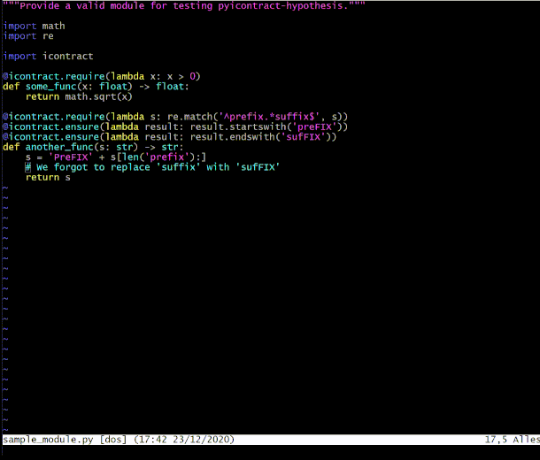

# icontract-hypothesis-vim

Icontract-hypothesis-vim is a Vim plug-in for 
`icontract-hypothesis <https://pypi.org/project/icontract-hypothesis/>`_, a tool 
that integrates `Hypothesis library <https://pypi.org/project/hypothesis/>`_ for property-based 
testing with `icontract library <https://pypi.org/project/icontract/>`_ for design-by-contract
in Python.



## Usage

Move the cursor to the function that you want to test or select a range of
functions.

### `:IcontractHypothesisTest [settings ...]`
    
Automatically infer the test strategy and execute it.

If {settings} are provided, they are passed to Hypothesis.
The format of the settings is `name=value`.

Example:

```
:IcontractHypothesisTest max_examples=500
```

### :IcontractHypothesisInspect

    Infer the test strategy and display it.

    No tests are executed.

Example:

```
:IcontractHypothesisInspect
```

## Installation

- Install [icontract-hypothesis][1] separately. Make sure it is on your PATH.
- [Download icontract_hypothesis.vim][2] and put it in the "autoload" directory
  (e.g., "~/.vim/autoload"). Alternatively, use [pathogen](https://github.com/tpope/vim-pathogen) or 
  a similar package manager.

[1]: https://github.com/mristin/icontract-hypothesis#installation
[2]: https://raw.githubusercontent.com/mristin/icontract-hypothesis-vim/master/plugin/icontract_hypothesis.vim

## Versioning

We follow [Semantic Versioning](http://semver.org/spec/v1.0.0.html).
The version X.Y.Z indicates:

* X is the major version (backward-incompatible),
* Y is the minor version (backward-compatible), and
* Z is the patch version (backward-compatible bug fix).
